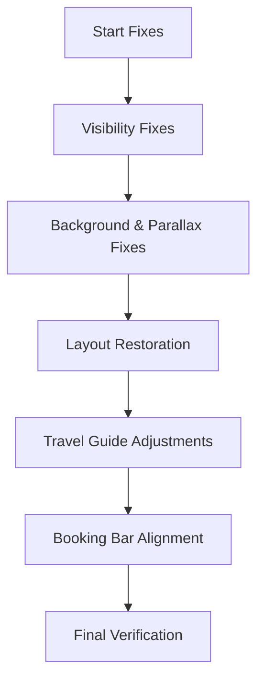

# UI Regression Fix Plan

## 1. Restore Visibility ("Who Are We?" & Travel Guide)
- **CSS ([`static/assets/css/enhancements.css`](static/assets/css/enhancements.css))**:
  - Update `section.spotlight .content` to have `opacity: 0` and transition for `opacity` and `transform` (0.8s ease-out).
  - Ensure `.in-view` class forces `opacity: 1 !important` and `transform: none !important`.
- **JS ([`static/assets/js/enhancements.js`](static/assets/js/enhancements.js))**:
  - Refine `IntersectionObserver` to ensure it properly adds `.in-view` and sets opacity.

## 2. Fix Background Echoes & Restore Parallax
- **CSS ([`static/assets/css/enhancements.css`](static/assets/css/enhancements.css))**:
  - Target `section.spotlight` and `#banner`.
  - Set `background-repeat: no-repeat !important`.
  - Set `background-size: cover !important`.
  - Set `background-position: center center !important`.
  - Restore `background-attachment: fixed !important` for desktop.
  - Set `background-color: #1c1d26 !important` as fallback.

## 3. Restore Alternating Layouts
- **CSS ([`static/assets/css/enhancements.css`](static/assets/css/enhancements.css))**:
  - Verify that `section.spotlight.style2.right` and `section.spotlight.style3.left` are correctly handled.
  - Remove any global `flex-direction` overrides that break the original L/R flow.

## 4. Travel Guide Element Positioning
- **CSS ([`static/assets/css/enhancements.css`](static/assets/css/enhancements.css))**:
  - Target `#hiking-spotlight`.
  - Set `display: flex`, `flex-direction: column`, `justify-content: flex-end`.
  - Ensure `.content` sits at the bottom.
  - Check `#two1` and `#three1` for visibility.

## 5. Booking Bar Alignment
- **CSS ([`static/assets/css/enhancements.css`](static/assets/css/enhancements.css))**:
  - Target `.search-summary .search-item`.
  - Target `.input-stack`.
  - Apply `display: flex`, `flex-direction: column`, `justify-content: flex-end`.
  - Ensure `<label>` elements have consistent height and margins.

## Mermaid Workflow

